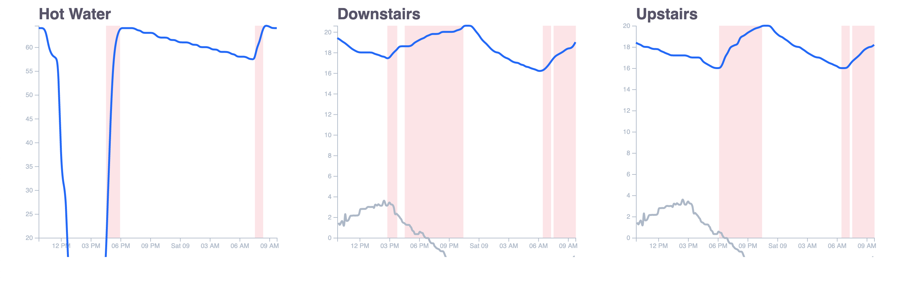

# Ember smart thermometer data

## Overview

I recently moved homes and the house has an [Ember smart meter](https://emberapp.ephcontrols.com/). It's perfectly functional in itself, however it doesn't seem to be widely support (e.g. no control from Google assistant). As a starting point this is a reverse-engineer and play with the functionality provided by the app. As it stands there are 3 parts to this project:

### sensor-read 

This is a standalone node app that reads the current data from ember and stores in dynamodb. This is run in an AWS lambda every 5 minutes allowing the display and analysis of historical data.

### weather-read

This is a standalone node app that reads the current weather data from an entirely separate weather API to get the weather data. The only use of this is to augment the thermometer data.

### display

This is a front end app that displays the sensor and weather data in graphs for easy viewing.



Orange background shows when heating was on, blue line shows sensor temperature, grey line shows outdoor temperature.

This can be run for dev with:

```
npm run dev
```

Which will build the typescript and run locally. Note: you will see an empty page if you do not specify an AWS access and secret key. To copy this project for yourself AWS would have to be setup the same as mine which may be hard to do at the moment as I have not provided cloudformation or terraform templates.

## Infrastructure

Infrastructure is in AWS and consists of:

- DynamoDB
  - Table called ember with key of sensorId (String) and sort key of time (Number)
  - Table called weather with key of id (String) and sort key of dt (Number)
- SSM parameter
  - ember_username - your ember login username
  - ember_password - your emeber login password
  - weather_map_api_key - A free API key for [OpenWeatherMap](https://openweathermap.org/)
- Lambda
    - Lambda for sensor-read, must have write permissions for dynamodb ember table & read permissions for parameter store ember_username and ember_password. Configured via cloudwatch events to run every N minutes
    - Lambda for weather-read, must have write permissions for dynamodb weather table & read permissions for parameter store weather_map_api_key. Configured via cloudwatch events to run every N minutes

## TODO

This project was hacked together in 2 hours as a POC. A rough TODO list:

- Get infrastructure into terraform or cloudformation
- Rewrite frontend (probably use vue with d3 or a higher level charting library)
- Handle errors in lambdas better
- Add functionality to boost heating etc in front end
- Separate out the Ember API into it's own project to allow separate projects (voice assistant support)
